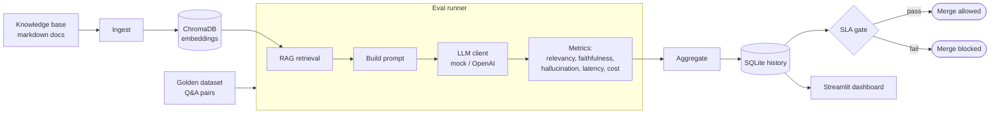

# LLM Eval CI/CD Pipeline

> Automated quality gate for LLM outputs: like unit tests, but for a RAG assistant.
> Every pull request re-evaluates the pipeline and **blocks the merge if quality drops**.


<!-- After pushing to GitHub, add the CI badge:
 -->

---

## Table of contents

- [Why this project](#why-this-project)
- [Architecture](#architecture)
- [Measured metrics](#measured-metrics)
- [Quick start](#quick-start)
- [How CI works](#how-ci-works)
- [Project structure](#project-structure)
- [Development](#development)
- [Optional: DeepEval](#optional-deepeval)
- [Screenshots](#screenshots)
- [What I learned](#what-i-learned)

## Why this project

LLM outputs degrade silently. Change a prompt, swap the model, or update the RAG knowledge base,
and the assistant can start hallucinating, slowing down, or getting more expensive, and classic
unit tests will not notice. This project treats answer quality as something you can **measure and
gate in CI**.

The demonstration domain is a **generic digital bank / fintech assistant** (cards, transfers,
fees, KYC, security), deliberately not tied to any brand, so the pipeline stays universal.

## Architecture



## Measured metrics

| Metric | How it is computed | Why it matters |
| --- | --- | --- |
| **Hallucination rate** | LLM-as-judge verdicts (model grades whether the answer is supported) | A hallucinating banking assistant gives harmful advice |
| **Answer relevancy** | Cosine similarity of question vs answer embeddings | Catches off-topic or evasive answers |
| **Faithfulness** | Cosine similarity of answer vs retrieved context | Measures grounding in the sources |
| **Latency p50 / p95** | Percentiles of per-query latency | Percentiles expose the slow tail that averages hide |
| **Cost / query** | Token count × model pricing | Catches prompt-bloat regressions early |

## Quick start

```bash
# Requires uv (https://docs.astral.sh/uv/)
uv sync --extra dev

cp .env.example .env            # default "mock" mode works with NO API key

uv run python -m scripts.seed_golden_dataset    # create the golden dataset
uv run python -m scripts.load_knowledge_base    # build the RAG vector store
uv run python -m src.eval.runner                # run the evaluation (saves to SQLite)
uv run python -m src.eval.gate                  # SLA gate: exit 1 if a threshold is breached
uv run streamlit run src/dashboard/app.py       # open the metrics dashboard
```

By default everything runs in **mock mode**: offline, deterministic, and free. To evaluate
against the real model, set `LLM_MODE=openai` and `OPENAI_API_KEY` in `.env`.

## How CI works

On every pull request, [.github/workflows/eval.yml](.github/workflows/eval.yml):

1. installs dependencies with `uv`,
2. rebuilds the RAG knowledge base,
3. runs the evaluation in **mock mode**, so CI is **free and deterministic** (no paid API calls,
   no flaky pass/fail from model randomness),
4. posts the results as a **sticky comment on the PR** (a metrics table with pass/fail per
   threshold),
5. runs the **SLA gate**, which exits non-zero on any violation. Marked as a required check in
   branch protection, a failure **blocks the merge**.

Real-quality evaluation against the live model is run separately (locally, or in a job with a
secret key) when needed, keeping the per-PR feedback loop fast and free.

## Project structure

```
config/    # SLA thresholds (thresholds.yaml) and model definitions/pricing (models.yaml)
data/      # golden_dataset.jsonl + knowledge_base/*.md (+ generated metrics.db)
src/
  config.py          # Pydantic config: model pricing + SLA thresholds
  golden_dataset.py  # Pydantic schema + JSONL validation
  paths.py           # central paths
  pipeline/          # rag.py (ChromaDB), llm_client.py (mock/OpenAI), prompt.py
  eval/              # metrics.py, runner.py, gate.py, report.py
  storage/db.py      # SQLite metrics history
  dashboard/app.py   # Streamlit dashboard
scripts/   # seed_golden_dataset.py, load_knowledge_base.py
tests/     # pytest tests for metrics and the gate
```

## Development

```bash
uv run ruff check .          # lint
uv run ruff format .         # format
uv run mypy src              # static types (strict)
uv run pytest                # tests
```

## Optional: DeepEval

The core metrics are hand-written so they are transparent and run for free in CI. As a "hybrid",
an optional module ([src/eval/deepeval_metrics.py](src/eval/deepeval_metrics.py)) scores the same
answers with the industry-standard **DeepEval** library. DeepEval's metrics use an LLM judge, so
this path requires an OpenAI API key and is not part of the free CI run.

```bash
uv sync --extra deepeval
uv run python -m src.eval.deepeval_metrics
```

## Screenshots

<!-- TODO: add a screenshot of the Streamlit dashboard here.
     Tip: in mock mode all runs are identical (deterministic), so the trend lines are flat.
     For a lively chart, generate a few runs against the real API or vary the prompt/thresholds. -->

## What I learned

- **Program to an interface.** Hiding OpenAI behind an `LLMClient` abstraction (with a mock
  implementation) made the whole pipeline testable and free to run in CI.
- **LLM-as-judge.** Using one model to grade another's output is cheap and scalable; consistency
  comes from temperature 0, a strict rubric, and structured (JSON) output.
- **Percentiles over averages.** A mean latency hides the slow tail; p95 is what users actually
  feel, which is why SLAs are written as percentiles.
- **A threshold must match its metric's scale.** Embedding-based scores rarely exceed ~0.7, so I
  calibrated the gate against a real baseline instead of guessing, because otherwise the gate
  raises false alarms on a healthy pipeline.
- **Pick the right tool for the scale.** SQLite (one file, no server) is plenty for a single-writer
  metrics history; Postgres would be over-engineering here.
- **Free, deterministic CI.** Running the evaluation on a mock keeps per-PR feedback fast and free,
  while real-quality checks run on demand.